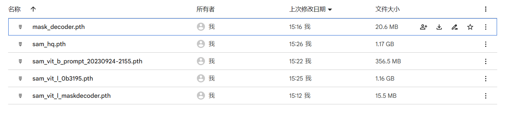
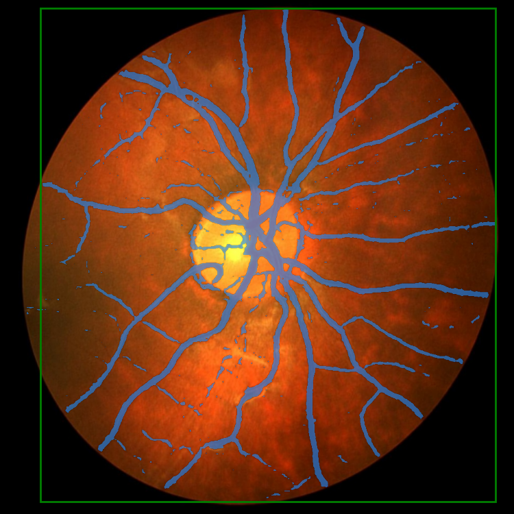
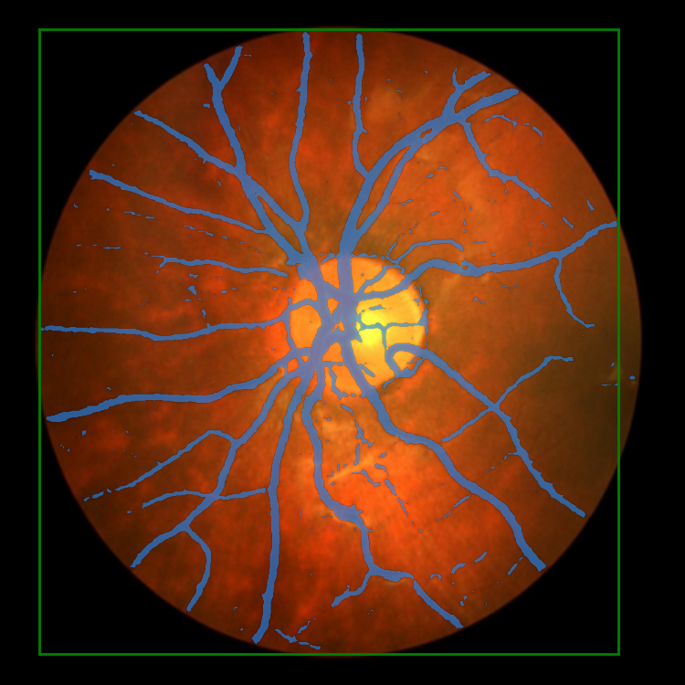

# Retinal-Vessel-Segmentation-by-SAM


We organize the training folder as follows.

```
|train
|    |____CHASEDB1
|    |____pretrained_checkpoint
|    |____train.py
|    |____predict.py
|    |____utils
|    |   |___dataloader.py
|    |   |____misc.py
|    |   |____loss_mask.py
|    |____segment_anything_training
|    |____output
```
## environment
run ```pip install -e .``` 

## 1. Data Preparation

CHASEDB1 data set can be downloaded from [here](https://drive.google.com/drive/folders/1-kzNpA_vdlIzaGZEURr5DJvVMDCugaQc?usp=drive_link).

we have done Augment on the original CHASEDB1 dataset

### Expected dataset structure for CHASEDB1

```
CHASEDB1
|____train
| |____img
| |____valid_mask
|____test
| |____...
| |____...
|____validation
| |____...
| |____...

```

## 2. Init Checkpoint
Init checkpoint can be downloaded from [our google disk](https://drive.google.com/drive/folders/1-kzNpA_vdlIzaGZEURr5DJvVMDCugaQc?usp=drive_link)
files are as follow:


### Expected checkpoint

```
pretrained_checkpoint
|____sam_vit_l_maskdecoder.pth
|____sam_vit_l_0b3195.pth
|____sam_decoder.pth 
```

```sam_vit_l_maskdecoder.pth``` and``` sam_vit_l_0b3195.pth``` are processed from ```sam_vit_l.pth```

```sam_decoder.pth```  is the final model we train.


## 3. Training
run ```python train.py``` to train 

the result will be output to ```./output/date/```

## 4. Evaluation
To evaluate ,run ```python predict.py```

the image will also output to ```./output/date/```


## demo result

